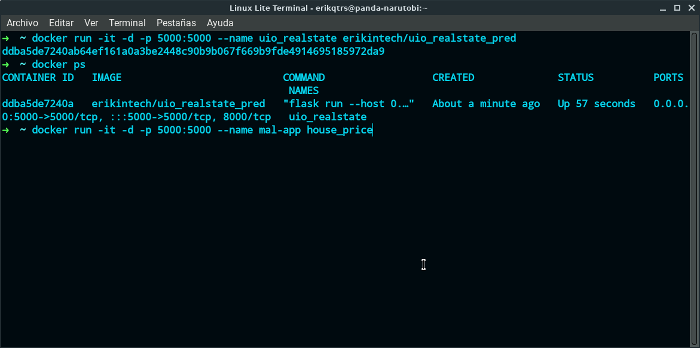
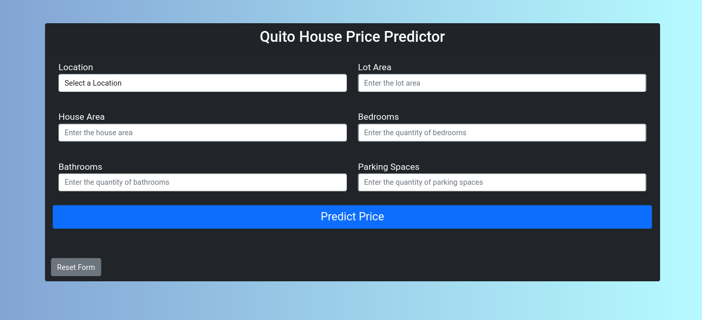

    

<h2>1.- Introduction</h2>

Let's suppose that a person wants to buy or sell a house, many times this person does not know either the real or the estimated cost of doing one of these two operations, in the same way many companies or people dedicated to buying houses as investments can pay too much for a house, That is why I think that using a house price predictor can help you make better decisions when it comes to selling or buying a house, knowing the estimated value of a property in the city of Quito depending on several characteristics that a house has.

<h2>2.- Project Goal</h2>

Create a house price predictor that helps sellers, buyers or investors know the estimated value of a property and helps these people or companies make better decisions when doing any of the aforementioned operations.

<h2>3.- Data</h2>

The information used for this project was obtained from the plusvalia.com page using web scraping techniques with Python and the BeautifulSoup library, with which it was possible to obtain more than 7000 records that with the respective data cleaning using Pandas a little more than 4900 records were used.

<h3>Data Description</h3>
<table>
    <thead>
        <tr>
            <td>Column</td>
            <td>Description</td>
            <td>Datatype</td>
        </tr>
    </thead>
    <tbody>
        <tr>
            <td>Location</td>
            <td>Neighboor house</td>
            <td>Object</td>
        </tr>
        <tr>
            <td>lotArea</td>
            <td>Size of the lote in m2sup></td>
            <td>Integer</td>
        </tr>
        <tr>
            <td>houseArea</td>
            <td>Size of the built area in m2sup></td>
            <td>Integer</td>
        </tr>
        <tr>
            <td>bedroom</td>
            <td>Number of bedrooms</td>
            <td>Integer</td>
        </tr>
        <tr>
            <td>bathroom</td>
            <td>Number of bathrooms</td>
            <td>Integer</td>
        </tr>
        <tr>
            <td>parkingSpaces</td>
            <td>Number of parking spaces</td>
            <td>Integer</td>
        </tr>
        <tr>
            <td>price</td>
            <td>Price of the house in USD</td>
            <td>Integer</td>
        </tr>
    </tbody>
</table>

<h3>Data Cleaning</h3>

**Missing values:** The missing values in this case were removed

**Outliers:** Atypical data was also found in several columns of the data set, in the same way they were deleted.

**Data Filtering:** To improve the predictor results, the use of records where locations had less than 10 houses was omitted.

<h2>4.- Machine Learning Models </h2>

<h3>Data Splitting</3>

- Train data set 80%
- Test data set 20%

<h3>Model</h3>

In the project, 3 linear regression models were used, Random Forest and Gradient Boosting, in addition, data coding techniques were used for the location column using the Scikit Learn library and the OneHotEncoder method.

Data scaling was also used and in order to train the models, a machine learning pipeline was created.

<h3>Model Metrics</h3>

<table>
    <thead>
        <tr>
            <td>Algorithm</td>
            <td>MSE</td>
            <td>RMSE</td>
            <td>Adjusted R2</td>
        </tr>
    </thead>
    <tbody>
        <tr>
            <td>Linear Regression</td>
            <td>43891.38</td>
            <td>63787.66</td>
            <td>0.80</td>
        </tr>
        <tr>
            <td>Ridge Regression</td>
            <td>43887.51</td>
            <td>63786.58</td>
            <td>0.80</td>
        </tr>
        <tr>
            <td>Lasso Regression</td>
            <td>43545.79</td>
            <td>63692.70</td>
            <td>0.80</td>
        </tr>
        <tr>
            <td>Random Forest</td>
            <td>38845.07</td>
            <td>61852.59</td>
            <td>0.81</td>
        </tr>
        <tr>
            <td>Gradient Boosting</td>
            <td>39742.68</td>
            <td>60792.62</td>
            <td>0.82</td>
        </tr>
    </tbody>
</table>

In the end, the Gradient Boosting model was used to fold the model, and I used the Flask python framework to put the model into production and any user can use the project.

Over time, the ideal would be to increase the amount of data and retrain the model to improve the predictions.

<h2>5. How to reproduce the app</h2>h2>

You have two way of reproducing the web apllication.

1. Downloan the github repository:
   * Clone the github repository in folder, write in a terminal `git clone https://github.com/erikintech/uio_realstate_prediciton.git`
   * Open the repository folder, *uio_realstate_prediction* folder 
   * Open a terminal or bash in this folder
   * Create a virtual enviroment: `python -m virtualenv venv` and active the virtualenv
   * Install all dependencies: `pip install -r requirements`
   * Run the command `python app.py` and in a web browser access to the http://localhost:5000 to use the application.

2. Downloa the docker image
   * You should have installed docker in your computer
   * In a terminal run the next commmand: `docker run -it -d -p 5000:5000 --name <write a name for the container> erikintech/uio_realstate_pred`
   * Check if the container in running: `docker ps`, if you see something similar to the image below

   

   you can try in a web browser the application,  only write the web address `localhost:5000`

<h3> <strong>Contact Me</strong> </h3>

